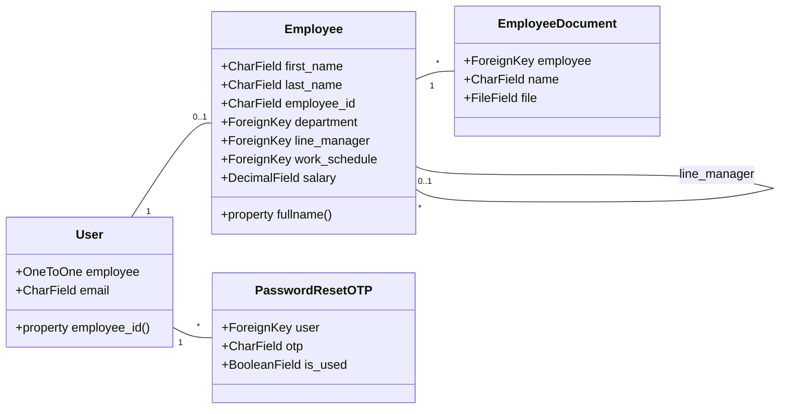
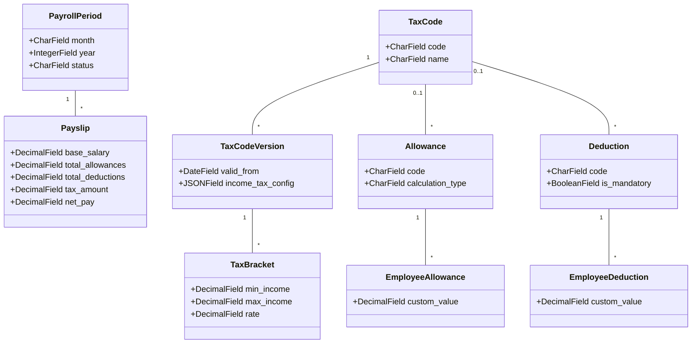
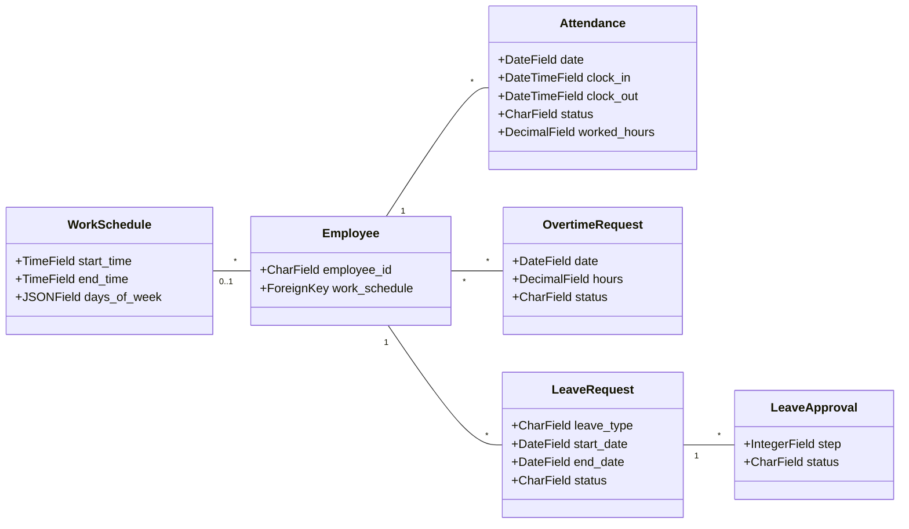

# HR & Payroll System - Backend Class Diagram

This document provides a comprehensive class diagram of the Django backend models and their relationships.

## System Overview

The HR & Payroll Management System backend consists of **15 Django apps** with **27 models** organized into the following domains:

| Domain | Apps | Models |
|--------|------|--------|
| **User Management** | users | User, PasswordResetOTP |
| **Employee Management** | employees | Employee, EmployeeDocument |
| **Organization** | departments, company | Department, CompanyInfo |
| **Time & Attendance** | attendance | Attendance, WorkSchedule, OvertimeRequest |
| **Leave Management** | leaves | LeaveRequest, LeaveApproval |
| **Payroll** | payroll | PayrollPeriod, PayrollApprovalLog, Payslip, TaxCode, TaxCodeVersion, TaxBracket, Allowance, Deduction, EmployeeAllowance, EmployeeDeduction |
| **Communication** | notifications, announcements, chat | Notification, Announcement, AnnouncementAttachment, AnnouncementView, Conversation, Message |
| **Performance** | efficiency | EfficiencyTemplate, EfficiencyEvaluation |
| **Policies & Support** | policies, support | Policy, FAQ |

---

## Complete Class Diagram

```mermaid
classDiagram
    direction TB

    %% ========================================
    %% USER MANAGEMENT DOMAIN
    %% ========================================
    
    class User {
        <<AbstractUser>>
        +OneToOne employee : Employee
        +CharField email
        +property employee_id()
        +__str__()
    }
    
    class PasswordResetOTP {
        +ForeignKey user : User
        +CharField otp
        +DateTimeField created_at
        +BooleanField is_used
    }

    %% ========================================
    %% EMPLOYEE MANAGEMENT DOMAIN
    %% ========================================
    
    class Employee {
        <<Core Entity>>
        --- GENERAL INFO ---
        +CharField first_name
        +CharField last_name
        +CharField gender
        +DateField date_of_birth
        +CharField marital_status
        +CharField nationality
        +CharField personal_tax_id
        +CharField social_insurance
        +CharField health_care
        +CharField phone
        +CharField email
        +ImageField photo
        --- ADDRESS ---
        +TextField primary_address
        +CharField country
        +CharField state
        +CharField city
        +CharField postcode
        --- EMERGENCY CONTACT ---
        +CharField emergency_fullname
        +CharField emergency_phone
        +CharField emergency_relationship
        --- JOB INFO ---
        +CharField employee_id [unique]
        +CharField job_title
        +CharField position
        +ForeignKey department : Department
        +ForeignKey line_manager : Employee
        +CharField employment_type
        +DateField join_date
        +IntegerField service_years
        +ForeignKey work_schedule : WorkSchedule
        --- CONTRACT ---
        +CharField contract_number
        +CharField contract_name
        +CharField contract_type
        +DateField contract_start_date
        +DateField contract_end_date
        --- PAYROLL ---
        +CharField status
        +DecimalField salary
        +DateField last_working_date
        +DecimalField offset
        +DecimalField one_off
        +CharField bank_name
        +CharField bank_account
        --- ORG CHART ---
        +BooleanField in_org_chart
        +FloatField org_x
        +FloatField org_y
        --- METADATA ---
        +DateTimeField created_at
        +DateTimeField updated_at
        +property fullname()
        +save()
    }
    
    class EmployeeDocument {
        +ForeignKey employee : Employee
        +CharField name
        +FileField file
        +CharField document_type
        +DateTimeField uploaded_at
        +ForeignKey uploaded_by : Employee
        +TextField notes
    }

    %% ========================================
    %% ORGANIZATION DOMAIN
    %% ========================================
    
    class Department {
        +CharField name
        +CharField code [unique]
        +TextField description
        +ForeignKey manager : Employee
        +ForeignKey parent : Department
        +BooleanField is_active
        +DateTimeField created_at
        +DateTimeField updated_at
    }
    
    class CompanyInfo {
        +CharField name
        +TextField address
        +CharField country_code
        +CharField phone
        +EmailField email
        +TextField description
        +ImageField logo
        +URLField website
        +CharField tax_id
        +DateTimeField updated_at
    }

    %% ========================================
    %% ATTENDANCE DOMAIN
    %% ========================================
    
    class Attendance {
        +ForeignKey employee : Employee
        +DateField date
        +DateTimeField clock_in
        +DateTimeField clock_out
        +CharField clock_in_location
        +CharField clock_out_location
        +CharField status
        +DecimalField worked_hours
        +TextField notes
        +property attendance_id()
        +save() : auto-calculates status & hours
    }
    
    class WorkSchedule {
        +CharField title
        +TimeField start_time
        +TimeField end_time
        +JSONField days_of_week
        +CharField schedule_type
        +CharField hours_per_day
        +CharField hours_per_week
        +DateTimeField created_at
    }
    
    class OvertimeRequest {
        +DateField date
        +DecimalField hours
        +TextField justification
        +ForeignKey manager : Employee
        +ManyToMany employees : Employee
        +CharField status
        +DateTimeField created_at
    }

    %% ========================================
    %% LEAVE MANAGEMENT DOMAIN
    %% ========================================
    
    class LeaveRequest {
        <<LEAVE_TYPES: annual, sick, personal, maternity, paternity, unpaid, other>>
        <<STATUS: pending, manager_approved, approved, denied, cancelled>>
        +ForeignKey employee : Employee
        +CharField leave_type
        +DateField start_date
        +DateField end_date
        +IntegerField days
        +TextField reason
        +CharField status
        +FileField attachment
        +DateTimeField submitted_at
    }
    
    class LeaveApproval {
        +ForeignKey leave_request : LeaveRequest
        +IntegerField step
        +CharField role
        +ForeignKey approver : Employee
        +CharField status
        +TextField comment
        +DateTimeField decided_at
    }

    %% ========================================
    %% PAYROLL DOMAIN
    %% ========================================
    
    class PayrollPeriod {
        <<STATUS: draft, generated, pending_approval, approved, finalized, rolled_back>>
        +CharField month
        +IntegerField year
        +CharField status
        +ForeignKey created_by : Employee
        +DateTimeField created_at
        +ForeignKey submitted_by : Employee
        +DateTimeField submitted_at
        +ForeignKey approved_by : Employee
        +DateTimeField approved_at
        +DateTimeField finalized_at
        +TextField notes
    }
    
    class PayrollApprovalLog {
        <<ACTION: created, generated, submitted, approved, finalized, rolled_back>>
        +ForeignKey period : PayrollPeriod
        +CharField action
        +ForeignKey performed_by : Employee
        +DateTimeField performed_at
        +TextField notes
        +CharField previous_status
        +CharField new_status
    }
    
    class Payslip {
        +ForeignKey period : PayrollPeriod
        +ForeignKey employee : Employee
        +DecimalField base_salary
        +DecimalField total_allowances
        +DecimalField bonus
        +DecimalField overtime_hours
        +DecimalField overtime_rate
        +DecimalField overtime_pay
        +DecimalField total_deductions
        +DecimalField tax_amount
        +DecimalField gross_pay
        +DecimalField net_pay
        +ForeignKey tax_code : TaxCode
        +ForeignKey tax_code_version : TaxCodeVersion
        +IntegerField worked_days
        +IntegerField absent_days
        +IntegerField leave_days
        +BooleanField has_issues
        +TextField issue_notes
        +JSONField details
    }
    
    class TaxCode {
        +CharField code [unique]
        +CharField name
        +TextField description
        +BooleanField is_active
        +DateTimeField created_at
        +DateTimeField updated_at
    }
    
    class TaxCodeVersion {
        +ForeignKey tax_code : TaxCode
        +CharField version
        +DateField valid_from
        +DateField valid_to
        +BooleanField is_active
        +BooleanField is_locked
        +JSONField income_tax_config
        +JSONField pension_config
        +JSONField rounding_rules
        +JSONField compliance_notes
        +JSONField statutory_deductions_config
        +JSONField exemptions_config
        +DateTimeField created_at
        +DateTimeField updated_at
    }
    
    class TaxBracket {
        +ForeignKey tax_code_version : TaxCodeVersion
        +DecimalField min_income
        +DecimalField max_income
        +DecimalField rate
        +JSONField applies_to
        +DateTimeField created_at
    }
    
    class Allowance {
        <<CALC_TYPES: fixed, percentage, formula>>
        +CharField code [unique]
        +CharField name
        +TextField description
        +CharField calculation_type
        +DecimalField default_value
        +DecimalField percentage_value
        +TextField formula
        +BooleanField is_taxable
        +BooleanField is_active
        +JSONField applies_to
        +ForeignKey tax_code : TaxCode
        +ForeignKey tax_code_version : TaxCodeVersion
        +DateTimeField created_at
        +DateTimeField updated_at
    }
    
    class Deduction {
        <<CALC_TYPES: fixed, percentage, tiered, formula>>
        +CharField code [unique]
        +CharField name
        +TextField description
        +CharField calculation_type
        +DecimalField default_value
        +DecimalField percentage_value
        +TextField formula
        +BooleanField is_mandatory
        +BooleanField is_pre_tax
        +BooleanField is_active
        +JSONField applies_to
        +ForeignKey tax_code : TaxCode
        +DateTimeField created_at
        +DateTimeField updated_at
    }
    
    class EmployeeAllowance {
        +ForeignKey employee : Employee
        +ForeignKey allowance : Allowance
        +DecimalField custom_value
        +BooleanField is_active
        +DateField start_date
        +DateField end_date
        +DateTimeField created_at
    }
    
    class EmployeeDeduction {
        +ForeignKey employee : Employee
        +ForeignKey deduction : Deduction
        +DecimalField custom_value
        +BooleanField is_active
        +DateField start_date
        +DateField end_date
        +DateTimeField created_at
    }

    %% ========================================
    %% COMMUNICATION DOMAIN
    %% ========================================
    
    class Notification {
        <<TYPES: info, warning, success, error, message, request, system, leave, promotion, policy, hr, attendance, payroll>>
        +ForeignKey recipient : Employee
        +ForeignKey sender : Employee
        +CharField title
        +TextField message
        +CharField link
        +CharField notification_type
        +BooleanField is_read
        +DateTimeField created_at
    }
    
    class Announcement {
        <<PRIORITY: Normal, High, Urgent>>
        +CharField title
        +TextField content
        +ForeignKey author : Employee
        +ImageField image
        +CharField priority
        +BooleanField is_pinned
        +IntegerField views
        +DateTimeField created_at
        +DateTimeField updated_at
    }
    
    class AnnouncementAttachment {
        +ForeignKey announcement : Announcement
        +FileField file
        +CharField file_type
        +DateTimeField created_at
    }
    
    class AnnouncementView {
        +ForeignKey announcement : Announcement
        +ForeignKey user : User
        +DateTimeField viewed_at
    }
    
    class Conversation {
        +ManyToMany participants : User
        +DateTimeField updated_at
    }
    
    class Message {
        <<TYPES: text, image, video, audio, file>>
        +ForeignKey conversation : Conversation
        +ForeignKey sender : User
        +TextField content
        +FileField attachment
        +CharField message_type
        +ForeignKey reply_to : Message
        +BooleanField is_read
        +DateTimeField created_at
    }

    %% ========================================
    %% PERFORMANCE & EFFICIENCY DOMAIN
    %% ========================================
    
    class EfficiencyTemplate {
        +JSONField schema
        +BooleanField is_active
        +DateTimeField created_at
        +DateTimeField updated_at
    }
    
    class EfficiencyEvaluation {
        +ForeignKey employee : Employee
        +ForeignKey evaluator : Employee
        +ForeignKey template : EfficiencyTemplate
        +JSONField report_data
        +FloatField total_score
        +DateTimeField submitted_at
    }

    %% ========================================
    %% POLICIES & SUPPORT DOMAIN
    %% ========================================
    
    class Policy {
        +IntegerField organization_id
        +CharField section
        +JSONField content
        +IntegerField version
        +BooleanField is_active
        +DateTimeField updated_at
        +ForeignKey tax_code : TaxCode
    }
    
    class FAQ {
        <<CATEGORY: General, Payroll, Leave, Benefits>>
        <<STATUS: published, draft>>
        +CharField category
        +TextField question
        +TextField answer
        +CharField status
        +DateTimeField created_at
        +DateTimeField updated_at
    }

    %% ========================================
    %% RELATIONSHIPS
    %% ========================================

    %% User Relationships
    User "1" -- "0..1" Employee : employee (OneToOne)
    User "1" -- "*" PasswordResetOTP : user (FK)

    %% Employee Self-Relationships
    Employee "0..1" -- "*" Employee : line_manager (self-referential)

    %% Employee to Documents
    Employee "1" -- "*" EmployeeDocument : documents
    Employee "0..1" -- "*" EmployeeDocument : uploaded_documents

    %% Department Relationships
    Department "0..1" -- "*" Employee : department (FK)
    Department "0..1" -- "*" Department : parent (self-referential)
    Employee "0..1" -- "*" Department : manager

    %% WorkSchedule Relationships
    WorkSchedule "0..1" -- "*" Employee : work_schedule

    %% Attendance Relationships
    Employee "1" -- "*" Attendance : attendances
    Employee "1" -- "*" OvertimeRequest : overtime_initiations (manager)
    Employee "*" -- "*" OvertimeRequest : overtime_assignments (employees)

    %% Leave Relationships
    Employee "1" -- "*" LeaveRequest : leave_requests
    LeaveRequest "1" -- "*" LeaveApproval : approval_chain
    Employee "0..1" -- "*" LeaveApproval : approver

    %% Payroll Period Relationships
    Employee "0..1" -- "*" PayrollPeriod : created_by
    Employee "0..1" -- "*" PayrollPeriod : submitted_by
    Employee "0..1" -- "*" PayrollPeriod : approved_by
    PayrollPeriod "1" -- "*" PayrollApprovalLog : approval_logs
    Employee "0..1" -- "*" PayrollApprovalLog : performed_by
    PayrollPeriod "1" -- "*" Payslip : payslips
    Employee "1" -- "*" Payslip : employee

    %% Tax Code Relationships
    TaxCode "1" -- "*" TaxCodeVersion : versions
    TaxCodeVersion "1" -- "*" TaxBracket : tax_brackets
    TaxCode "0..1" -- "*" Allowance : allowances
    TaxCodeVersion "0..1" -- "*" Allowance : allowances
    TaxCode "0..1" -- "*" Deduction : deductions
    TaxCode "0..1" -- "*" Payslip : tax_code
    TaxCodeVersion "0..1" -- "*" Payslip : tax_code_version
    TaxCode "0..1" -- "*" Policy : policies

    %% Employee Allowance/Deduction Assignments
    Employee "1" -- "*" EmployeeAllowance : employee_allowances
    Allowance "1" -- "*" EmployeeAllowance : allowance
    Employee "1" -- "*" EmployeeDeduction : employee_deductions
    Deduction "1" -- "*" EmployeeDeduction : deduction

    %% Notification Relationships
    Employee "1" -- "*" Notification : recipient (notifications)
    Employee "0..1" -- "*" Notification : sender (sent_notifications)

    %% Announcement Relationships
    Employee "0..1" -- "*" Announcement : author (announcements)
    Announcement "1" -- "*" AnnouncementAttachment : attachments
    Announcement "1" -- "*" AnnouncementView : view_interactions
    User "1" -- "*" AnnouncementView : user

    %% Chat Relationships
    User "*" -- "*" Conversation : participants
    Conversation "1" -- "*" Message : messages
    User "1" -- "*" Message : sender (sent_messages)
    Message "0..1" -- "*" Message : reply_to (self-referential)

    %% Efficiency Relationships
    Employee "1" -- "*" EfficiencyEvaluation : evaluations
    Employee "0..1" -- "*" EfficiencyEvaluation : evaluator
    EfficiencyTemplate "0..1" -- "*" EfficiencyEvaluation : template
```

---

## Domain-Specific Diagrams

### 1. User & Employee Domain

### 2. Payroll Domain

### 3. Attendance & Leave Domain

---

## Key Relationships Summary

| Source Model | Relationship | Target Model | Related Name | Description |
|--------------|--------------|--------------|--------------|-------------|
| User | OneToOne | Employee | user_account | Links user account to employee profile |
| Employee | ForeignKey | Department | employees | Employee belongs to a department |
| Employee | ForeignKey | Employee (self) | direct_reports | Hierarchical manager relationship |
| Employee | ForeignKey | WorkSchedule | employees | Work schedule assignment |
| Attendance | ForeignKey | Employee | attendances | Daily attendance records |
| LeaveRequest | ForeignKey | Employee | leave_requests | Leave submissions |
| PayrollPeriod | ForeignKey | Employee | payroll_created | Payroll workflow tracking |
| Payslip | ForeignKey | PayrollPeriod | payslips | Individual payslips per period |
| Payslip | ForeignKey | Employee | - | Employee payslip link |
| TaxCode | OneToMany | TaxCodeVersion | versions | Tax code versioning |
| TaxCodeVersion | OneToMany | TaxBracket | tax_brackets | Progressive tax brackets |
| Notification | ForeignKey | Employee | notifications | Notification recipients |
| Conversation | ManyToMany | User | conversations | Chat participants |
| Message | ForeignKey | Conversation | messages | Chat messages |

---

## Database Tables Mapping

| Model | Database Table |
|-------|----------------|
| User | users |
| PasswordResetOTP | (default) |
| Employee | employees |
| EmployeeDocument | employee_documents |
| Department | departments |
| CompanyInfo | company_info |
| Attendance | attendance |
| WorkSchedule | work_schedules |
| OvertimeRequest | overtime_requests |
| LeaveRequest | leave_requests |
| LeaveApproval | leave_approvals |
| PayrollPeriod | payroll_periods |
| PayrollApprovalLog | payroll_approval_logs |
| Payslip | payslips |
| TaxCode | tax_codes |
| TaxCodeVersion | tax_code_versions |
| TaxBracket | tax_brackets |
| Allowance | allowances |
| Deduction | deductions |
| EmployeeAllowance | employee_allowances |
| EmployeeDeduction | employee_deductions |
| Notification | notifications |
| Announcement | announcements |
| AnnouncementAttachment | announcement_attachments |
| AnnouncementView | announcement_views |
| Conversation | chat_conversations |
| Message | chat_messages |
| EfficiencyTemplate | efficiency_templates |
| EfficiencyEvaluation | efficiency_evaluations |
| Policy | policies |
| FAQ | (default) |

---

## Notes

1. **Central Entity**: `Employee` is the central entity with relationships to most other models
2. **User-Employee Separation**: Authentication (`User`) is separated from HR data (`Employee`) via OneToOne relationship
3. **Versioning**: Tax codes support versioning for historical accuracy in payroll calculations
4. **Approval Workflows**: Both Leave and Payroll have multi-step approval workflows
5. **JSON Fields**: Several models use JSONField for flexible configuration (tax configs, policy content, efficiency schemas)
6. **Self-Referential**: Employee (line_manager), Department (parent), Message (reply_to) have self-referential relationships
